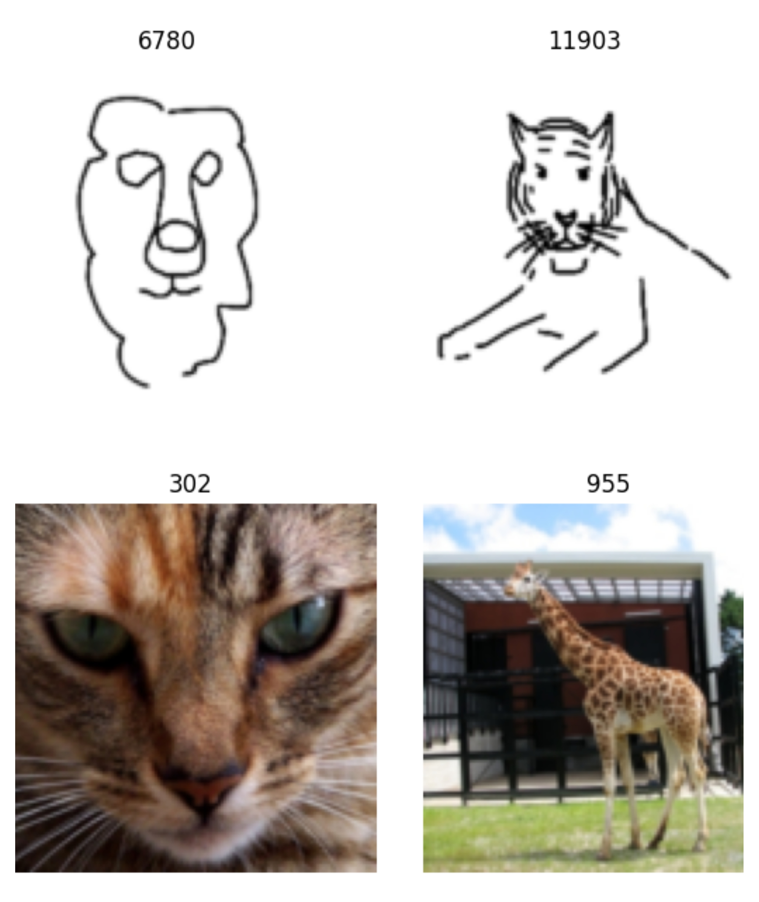
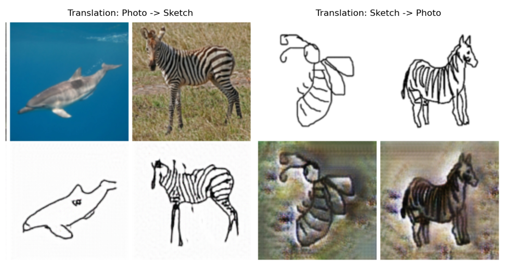

# Implementing CycleGAN for Sketch-to-Image Translation

This folder contains a concise implementation and notes for sketch <-> photo translation using Cycle-Consistent Generative Adversarial Networks (CycleGAN). The goal is to perform high-fidelity, unpaired image-to-image translation: convert hand-drawn sketches into realistic photographs and vice versa, without relying on paired training data.

The original implementation notebook are available on Kaggle: [Sketches-to-Image Translation Notebook](https://www.kaggle.com/code/zeeshankhalid666/sketches-to-image-translation-using-cycle-gans), and full blog on [here](https://zeshankhalid.com/blog/seq2seq-image_captioning/). 

## Introduction

Sketch-to-image translation is challenging because aligned (paired) sketch-photo examples are rare. CycleGAN sidesteps this requirement by learning two mappings (sketch -> photo and photo -> sketch) and enforcing cycle-consistency so that translating an input to the other domain and back reconstructs the original image. That constraint preserves structure while allowing appearance changes.

This project uses PyTorch and implements ResNet-based generators and PatchGAN discriminators, with cycle-consistency and identity losses to stabilize training and preserve style when appropriate.

## Architecture Overview

Two generators and two discriminators form the core loop:

- Generators (G_AB, G_BA): ResNet-based networks that perform sketch→photo and photo→sketch translation. Residual blocks help preserve spatial structure while refining appearance.
- Discriminators (D_A, D_B): PatchGAN discriminators that output a grid of local realism scores instead of a single global verdict, encouraging texture-level realism.

Losses:
- Adversarial loss for realistic targets in each domain.
- Cycle-consistency loss (L1) to enforce structural preservation: Loss_cycle = E[‖G_BA(G_AB(x)) − x‖_1].
- Identity loss (L1) to discourage unnecessary changes when input already belongs to the target domain.

## Dataset

This work uses the Sketch-to-Image dataset (125 categories), available on Kaggle: [Sketch-to-Image Dataset](https://www.kaggle.com/datasets/ankitsheoran23/sketch-to-image)

Implementation notebook (worked example with training and visualization): [Sketches-to-Image Translation Notebook](https://www.kaggle.com/code/zeeshankhalid666/sketches-to-image-translation-using-cycle-gans)

Preprocessing notes:
- Organize images into two directories: `data/sketches` and `data/photos`.
- Resize images to 128×128 (or larger if GPU memory allows).
- Normalize to [-1, 1] to match `tanh` output in generators.
- Use minor augmentations (random horizontal flip) to increase robustness.

Sample dataset images:

## Training & Evaluation

Training balances generator and discriminator updates with cycle and identity constraints. Typical recipe:
- Optimizers: Adam (beta1=0.5, beta2=0.999).
- Learning rate scheduling: constant for N epochs, then linear decay.
- Batch size: 8–32 depending on GPU memory.
- Use `itertools.cycle` to handle unbalanced domain sizes in the dataloaders.

Evaluation:
- Visual inspection of translated samples.
- Quantitative: SSIM and PSNR computed between reconstructed images and originals where appropriate. In the experiments, SSIM improved from ~0.25 to ~0.63 and PSNR from ~15.9 dB to ~22.8 dB over early training (20 epochs), which indicate improved structural fidelity and reduced artifacts.

Training losses and sample translations:

## Results & Notes

After relatively few epochs (e.g., 20), the model achieves stable adversarial balance and reasonable structural preservation. Extending training with learning-rate decay and larger resolutions improves texture fidelity. Potential improvements include conditional architectures, Vision Transformer backbones, or perceptual losses to handle complex categories better.
