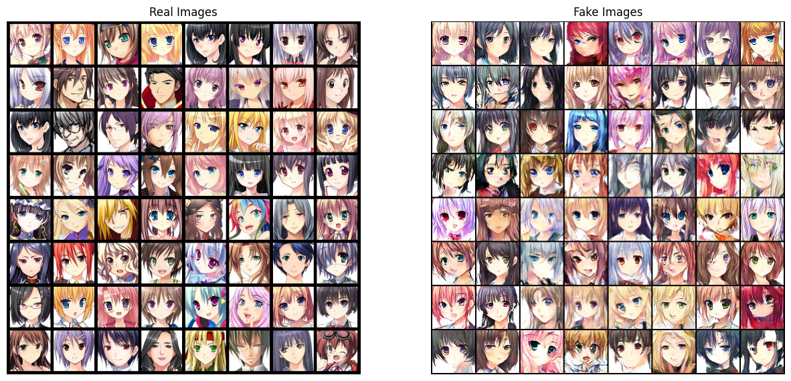

# Generating Anime Faces with DCGAN & WGAN-GP

The work compares the standard BCE-based DCGAN objective with the Wasserstein loss plus gradient penalty (WGAN-GP) to improve training stability and sample diversity.

- Notebook & code: https://www.kaggle.com/code/zeeshankhalid666/generating-anime-faces-with-gan-wgan-gp 
- Dataset: https://www.kaggle.com/datasets/soumikrakshit/anime-faces/data  
- Blog post: https://zeshankhalid.com/blog/generating-anime-faces-with-dcgan-and-wgan-gp/

## Architecture
The generator starts from a 4×4 feature map and upsamples through four ConvTranspose2d blocks (k=4, s=2, p=1) to produce 64×64 images, using BatchNorm + ReLU and a final Tanh to map outputs to [-1, 1].

The discriminator mirrors this with downsampling Conv2d blocks and LeakyReLU activations to compress spatial information into a scalar score. Channel widths decrease as spatial resolution increases so early layers capture global structure while later layers refine details. For WGAN-GP the discriminator is a critic (no Sigmoid), uses InstanceNorm, and returns raw scores for the Wasserstein objective.

## Training Pipeline
DCGAN uses `Adam(lr=2e-4, betas=(0.5, 0.999))`. WGAN-GP uses a lower lr and different betas (e.g., `lr=1e-4, betas=(0.0, 0.9`)) with multiple critic steps per generator update. The gradient penalty (`λ=10`) enforces the 1‑Lipschitz constraint. Computing GP lazily (every few critic steps) reduces compute. Pre-generate fake samples for critic passes to save time and monitor image grids frequently since visual checks are more reliable than loss curves for detecting collapse.

Below is a representative sample from the WGAN-GP runs (see notebook for full grids and training curves):

